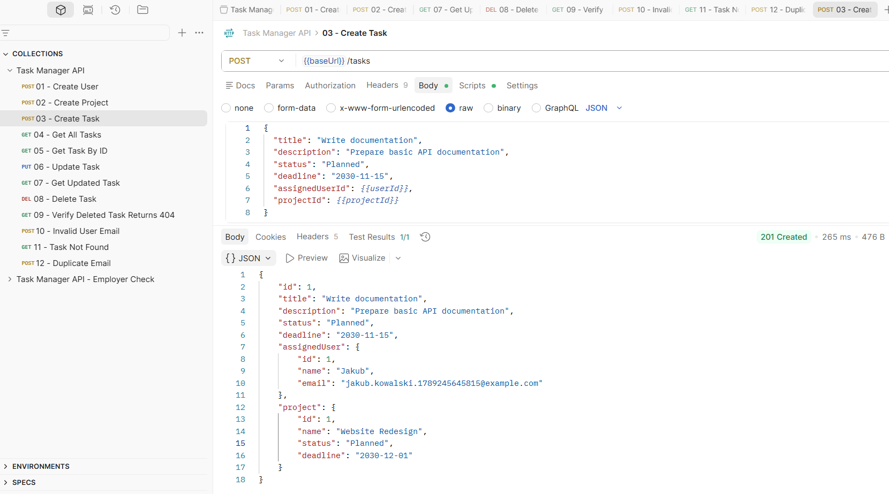
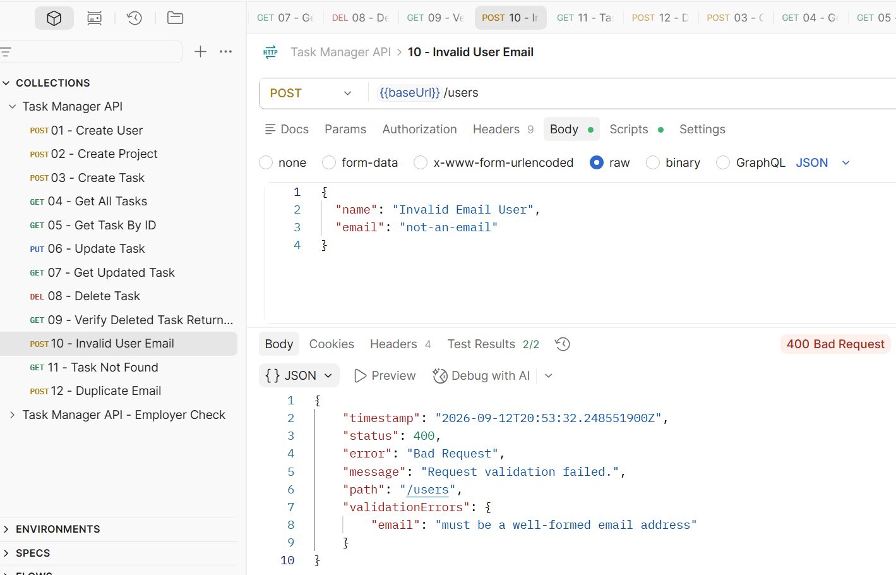
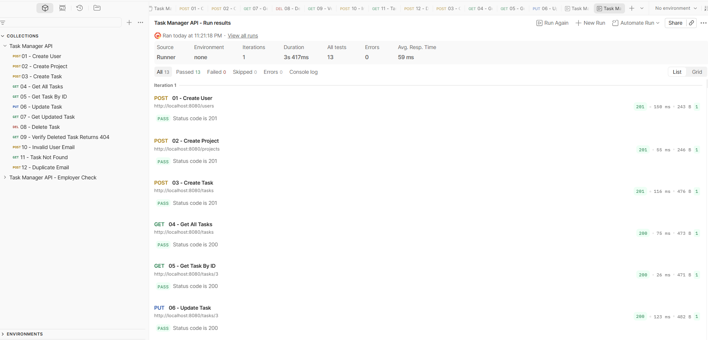
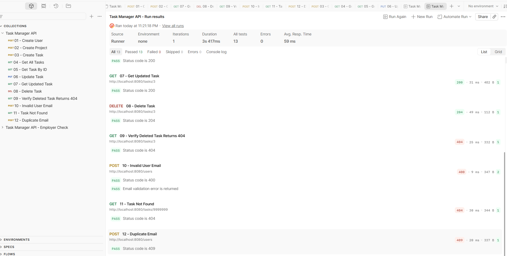

# Task Manager API

A REST API for managing users, projects and tasks.

Version 2 extends the original CRUD application with DTOs, request validation, centralized error handling, correct HTTP status codes, transactional service methods, unit tests, Docker Compose for PostgreSQL, and an updated Postman test collection.

## What it does

The application manages three main entities:

- User
- Project
- Task

Each task belongs to one user and one project.

A user can be assigned to multiple tasks, and a project can contain multiple tasks.

## Features

- CRUD operations for users
- CRUD operations for projects
- CRUD operations for tasks
- DTO-based API layer
- Request validation with Jakarta Bean Validation
- Centralized exception handling
- Correct HTTP response status codes
- Relations between tasks, users and projects
- PostgreSQL persistence with Spring Data JPA and Hibernate
- Transaction management with `@Transactional`
- Unit tests with JUnit 5 and Mockito
- PostgreSQL local environment with Docker Compose
- API verification with Postman

## Technologies

- Java 21
- Spring Boot
- Spring Web
- Spring Data JPA
- Hibernate
- Jakarta Bean Validation
- Maven
- PostgreSQL 15
- Docker Compose (PostgreSQL container)
- JUnit 5
- Mockito
- Postman
- Git

## Architecture

```text
HTTP JSON
    ↓
Request DTO
    ↓
Controller
    ↓
Service
   ↙     ↘
Mapper   Repository
  ↓         ↓
Entity   Hibernate / JPA
            ↓
        PostgreSQL
```

Dedicated mapper classes convert between DTOs and entities:

```text
Request DTO
    ↓
Mapper
    ↓
Entity

Entity
    ↓
Mapper
    ↓
Response DTO
```

This keeps persistence entities separate from the public API contract.

## Main endpoints

### Users

```http
POST   /users
GET    /users
GET    /users/{id}
PUT    /users/{id}
DELETE /users/{id}
```

### Projects

```http
POST   /projects
GET    /projects
GET    /projects/{id}
PUT    /projects/{id}
DELETE /projects/{id}
```

### Tasks

```http
POST   /tasks
GET    /tasks
GET    /tasks/{id}
PUT    /tasks/{id}
DELETE /tasks/{id}
```

## HTTP status codes

| Operation | Status |
|---|---|
| Successful GET | `200 OK` |
| Successful PUT | `200 OK` |
| Successful POST | `201 Created` |
| Successful DELETE | `204 No Content` |
| Validation error | `400 Bad Request` |
| Resource not found | `404 Not Found` |
| Duplicate user email | `409 Conflict` |

## Example request bodies

### Create User

```json
{
  "name": "Jakub",
  "email": "jakub.kowalski@example.com"
}
```

### Create Project

```json
{
  "name": "Website Redesign",
  "status": "Planned",
  "deadline": "2030-12-01"
}
```

### Create Task

A task requires an existing user and an existing project.

First create a user and a project. Then use their IDs in the task request.

```json
{
  "title": "Write documentation",
  "description": "Prepare basic API documentation",
  "status": "Planned",
  "deadline": "2030-11-15",
  "assignedUserId": 1,
  "projectId": 1
}
```

### Update Task

The task ID is provided in the request URL:

```text
PUT /tasks/{id}
```

The `assignedUserId` and `projectId` values must refer to existing records.

```json
{
  "title": "Update documentation",
  "description": "Add more details to API documentation",
  "status": "In Progress",
  "deadline": "2030-12-01",
  "assignedUserId": 1,
  "projectId": 1
}
```

## Validation and error handling

Request DTOs use Jakarta Bean Validation annotations such as:

- `@NotBlank`
- `@NotNull`
- `@Email`
- `@Size`
- `@Positive`
- `@FutureOrPresent`

Validation errors and application exceptions are handled centrally by `GlobalExceptionHandler`.

Example validation response:

```json
{
  "timestamp": "2026-09-12T20:00:00Z",
  "status": 400,
  "error": "Bad Request",
  "message": "Request validation failed.",
  "path": "/users",
  "validationErrors": {
    "email": "must be a well-formed email address"
  }
}
```

The application also defines custom exceptions for missing resources and duplicate user emails.

## Automated tests

The project contains 39 unit tests.

The tests cover:

- `UserService`
- `ProjectService`
- `TaskService`
- `UserMapper`
- `ProjectMapper`
- `TaskMapper`

Service tests use JUnit 5 and Mockito to verify business logic in isolation.

Mapper tests use real mapper instances and verify conversions between DTOs and entities.

Run the tests on Windows:

```powershell
.\mvnw.cmd test
```

On Linux or macOS:

```bash
./mvnw test
```

The unit test suite does not require a running PostgreSQL database.

## API verification with Postman

The Postman collection is available here:

[task-manager-api.postman_collection.json](postman/task-manager-api.postman_collection.json)

The collection contains 12 requests and 13 tests.

A successful Collection Runner execution produces:

```text
12 requests
13 tests passed
0 failed
0 errors
```

The collection uses these variables:

- `baseUrl`
- `userId`
- `projectId`
- `taskId`
- `userEmail`

The default API URL is:

```text
http://localhost:8080
```

### Dynamic test email

Before the first `POST /users` request, a Postman pre-request script generates a unique email:

```javascript
const uniqueEmail = `jakub.kowalski.${Date.now()}@example.com`;

pm.collectionVariables.set("userEmail", uniqueEmail);
```

The generated email is stored in the `userEmail` collection variable.

The same value is later reused to verify the duplicate-email conflict.

### Collection flow

| Step | Operation | Request | Expected status |
|---:|---|---|---|
| 01 | Create User | `POST /users` | `201 Created` |
| 02 | Create Project | `POST /projects` | `201 Created` |
| 03 | Create Task | `POST /tasks` | `201 Created` |
| 04 | Get All Tasks | `GET /tasks` | `200 OK` |
| 05 | Get Task By ID | `GET /tasks/{{taskId}}` | `200 OK` |
| 06 | Update Task | `PUT /tasks/{{taskId}}` | `200 OK` |
| 07 | Get Updated Task | `GET /tasks/{{taskId}}` | `200 OK` |
| 08 | Delete Task | `DELETE /tasks/{{taskId}}` | `204 No Content` |
| 09 | Verify Deleted Task | `GET /tasks/{{taskId}}` | `404 Not Found` |
| 10 | Invalid User Email | `POST /users` | `400 Bad Request` |
| 11 | Task Not Found | `GET /tasks/9999999` | `404 Not Found` |
| 12 | Duplicate Email | `POST /users` | `409 Conflict` |

### Example results

#### Create Task — 201 Created



#### Validation Error — 400 Bad Request



#### Postman Collection Runner — 13/13 tests passed

Requests 01–06:



Requests 07–12:



## How to run locally

### Prerequisites

- Java 21
- Docker with Docker Compose
- Git

### Clone the repository

```bash
git clone https://github.com/kateryna-tumanova/task-manager-api.git
cd task-manager-api
```

### Configure database environment variables

`DB_USERNAME` and `DB_PASSWORD` are used by both Docker Compose and the Spring Boot application.

`DB_URL` is used by the Spring Boot application. It is optional because the project already uses the following default URL:

```text
jdbc:postgresql://localhost:5432/taskmanager_db
```

Example values:

```text
DB_USERNAME=your_postgres_username
DB_PASSWORD=your_postgres_password
DB_URL=jdbc:postgresql://localhost:5432/taskmanager_db
```

Do not store real database credentials in the repository.

### Start PostgreSQL with Docker Compose

On Windows PowerShell:

```powershell
$env:DB_USERNAME="your_postgres_username"
$env:DB_PASSWORD="your_postgres_password"

docker compose up -d
```

On Linux or macOS:

```bash
export DB_USERNAME="your_postgres_username"
export DB_PASSWORD="your_postgres_password"

docker compose up -d
```

Check the PostgreSQL container:

```bash
docker compose ps
```

Docker Compose starts PostgreSQL locally on port `5432` and stores database data in a named Docker volume.

The PostgreSQL container initializes the `taskmanager_db` database on first startup.

Hibernate creates or updates the database tables when the Spring Boot application starts.

### Start the Spring Boot application

On Windows:

```powershell
.\mvnw.cmd spring-boot:run
```

On Linux or macOS:

```bash
./mvnw spring-boot:run
```

The API will be available at:

```text
http://localhost:8080
```

### Stop the local environment

Stop the Spring Boot application with `Ctrl+C`.

Then stop PostgreSQL:

```bash
docker compose down
```

The named PostgreSQL volume is preserved.

Do not use `docker compose down -v` unless you intentionally want to delete the PostgreSQL data volume.

## Version history

- `v1.0.0` — basic CRUD API using entities directly in HTTP requests and responses.
- `v2.0.0` — DTO-based API, validation, centralized error handling, transaction boundaries, unit tests, Docker Compose for PostgreSQL, and Postman verification.

## Current scope

Version 2 focuses on CRUD operations, DTO-based API design, validation, centralized error handling, transaction management, unit testing, and a reproducible PostgreSQL development environment.

Automated testing includes 39 Service and Mapper unit tests. HTTP behavior is additionally verified with the Postman collection.

The Spring Boot application runs locally with Maven, while Docker Compose is used for PostgreSQL.

Authentication, pagination and integration tests are not included in Version 2.